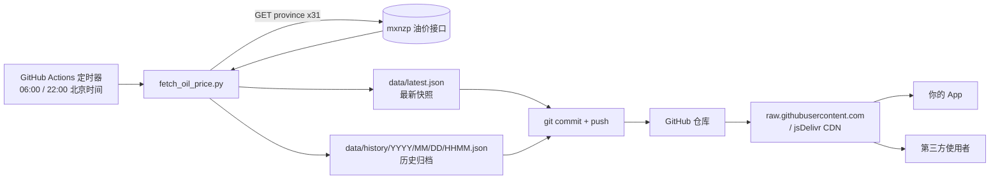

# OilPulse-CN 方案设计

## 1. 背景与目标

每天两次（06:00 / 22:00）从 mxnzp 油价接口采集全国 31 个省级行政区的油价，并把结果同步到
GitHub 仓库，使其可以被自己的 App 或任何第三方直接读取——本质上是把一个 GitHub 仓库当作
一个免费、只读、无需鉴权的"油价数据 CDN"。

设计目标：

- **零服务器**：不需要自己买服务器或云函数，全部跑在 GitHub Actions 的免费额度内。
- **稳定的读取地址**：始终有一个不变的 URL 指向"最新油价"，供 App 直接请求。
- **可回溯**：保留历史快照，方便做油价走势分析。
- **密钥不落地**：mxnzp 的 app_id / app_secret 只存在于 GitHub Secrets，不出现在代码或提交历史中。

## 2. 整体架构



## 3. 技术选型

| 组件 | 选择 | 理由 |
|---|---|---|
| 调度 | GitHub Actions `schedule` (cron) | 免费、免运维，天然和"同步到 GitHub"绑定在一起 |
| 采集脚本 | Python 3.11 + `requests` | 依赖少、逻辑简单，标准库 `zoneinfo` 处理时区 |
| 存储 | Git 仓库本身（JSON 文件） | 免费、有版本历史、天然支持 CDN 加速读取 |
| 分发 | `raw.githubusercontent.com` / jsDelivr | 无需额外部署 API 服务即可对外提供"读接口" |
| 密钥管理 | GitHub Actions Secrets | 不写入代码库，运行时以环境变量注入 |

## 4. 调度方案

GitHub Actions 的 `cron` 以 **UTC** 计时，北京时间 = UTC+8，换算如下：

| 北京时间 | UTC 时间 | cron 表达式 |
|---|---|---|
| 06:00 | 前一天 22:00 | `0 22 * * *` |
| 22:00 | 当天 14:00 | `0 14 * * *` |

工作流同时保留 `workflow_dispatch`，便于手动触发调试。

> 注意：GitHub Actions 的 `schedule` 触发在负载高峰期可能有几分钟延迟，属于平台已知特性，
> 对每天两次的采集频率影响可忽略。

## 5. 数据流程

1. Actions 触发 → checkout 仓库 → 安装依赖。
2. 脚本读取 `MXNZP_APP_ID` / `MXNZP_APP_SECRET` 环境变量（来自 Secrets）。
3. 依次请求 31 个省份，单省份最多重试 3 次，省份之间间隔 0.6 秒以避免触发接口限流。
4. 汇总为一份快照 JSON，同时写入：
   - `data/latest.json`（覆盖）
   - `data/history/YYYY/MM/DD/HHMM.json`（新增，永久保留）
5. 若 `data/` 有变化则 `git commit && git push`；若与上次完全一致则跳过提交，避免产生空提交。
6. 若单个省份持续失败，记录在 `failed_provinces` 字段中，不影响其余省份数据正常发布。
7. 若全部省份都失败（例如接口整体故障），本次任务以失败状态结束，且不覆盖 `latest.json`，
   保留上一次的有效数据，防止"用坏数据覆盖好数据"。

## 6. 数据结构

`data/latest.json`：

```json
{
  "updated_at": "2026-07-15T06:00:12+08:00",
  "source": "https://www.mxnzp.com/api/oil/search",
  "province_count": 31,
  "failed_provinces": [],
  "provinces": {
    "广东": { "province": "广东", "t0": "7.64", "t89": "7.42", "t92": "7.99", "t95": "8.65", "t98": "9.79" },
    "上海": { "province": "上海", "t0": "...", "t89": "...", "t92": "...", "t95": "...", "t98": "..." }
  }
}
```

`data/history/2026/07/15/0600.json` 结构与 `latest.json` 完全一致，只是文件名固定为
"当次运行时间"，用于历史回溯。

## 7. 安全设计

- app_id / app_secret **不写入任何提交的文件**，仅通过 GitHub 仓库的
  `Settings → Secrets and variables → Actions` 配置，运行时以环境变量形式注入脚本。
- 仓库建议设为 **Public**（因为数据本身就是要公开分发的只读数据），但 Secrets 在
  Public 仓库中同样不会被读取或暴露，GitHub 会自动屏蔽日志中的密钥字符串。
- 若未来需要限制访问，可将仓库改为 Private，并让消费方通过带 token 的
  GitHub API（而非 raw 域名）读取，或额外部署一层反代 + 鉴权。

## 8. 消费方式（其他人/你的 App 如何获取数据）

发布后，任何人都可以用固定 URL 直接读取最新数据，无需申请 mxnzp 的 key：

```
https://raw.githubusercontent.com/<你的GitHub用户名>/oilpulse-cn/main/data/latest.json
```

或使用 jsDelivr 免费 CDN 加速（更新有几分钟延迟，但速度更快、更稳定）：

```
https://cdn.jsdelivr.net/gh/<你的GitHub用户名>/oilpulse-cn@main/data/latest.json
```

历史数据同理，把路径换成对应日期：

```
https://raw.githubusercontent.com/<你的GitHub用户名>/oilpulse-cn/main/data/history/2026/07/15/0600.json
```

## 9. 异常与可观测性

- 每次运行的日志（每省份成功/失败、重试次数）都完整保留在 GitHub Actions 的运行记录里。
- `failed_provinces` 字段让消费方也能感知"哪些省份这次没采集到"，避免误以为是 0 元油价之类的脏数据。
- 后续可选增强：任务连续失败 N 次时，通过 GitHub Actions 自带的邮件通知或额外接入
  Slack/企业微信 Webhook 报警（本期不实现，属于路线图）。

## 10. 路线图（暂不实现，供后续参考）

- 按省份拆分出单独的小 JSON（如 `data/latest/shanghai.json`），减少消费方需要解析的数据量。
- 增加简单的价格趋势图（读取 history 生成 SVG/PNG，随 Actions 一并发布）。
- 用 GitHub Pages 包一层静态站点，提供更友好的查询页面。
- 增加数据校验（价格突变告警），防止上游接口偶发脏数据被当作正常数据发布。
